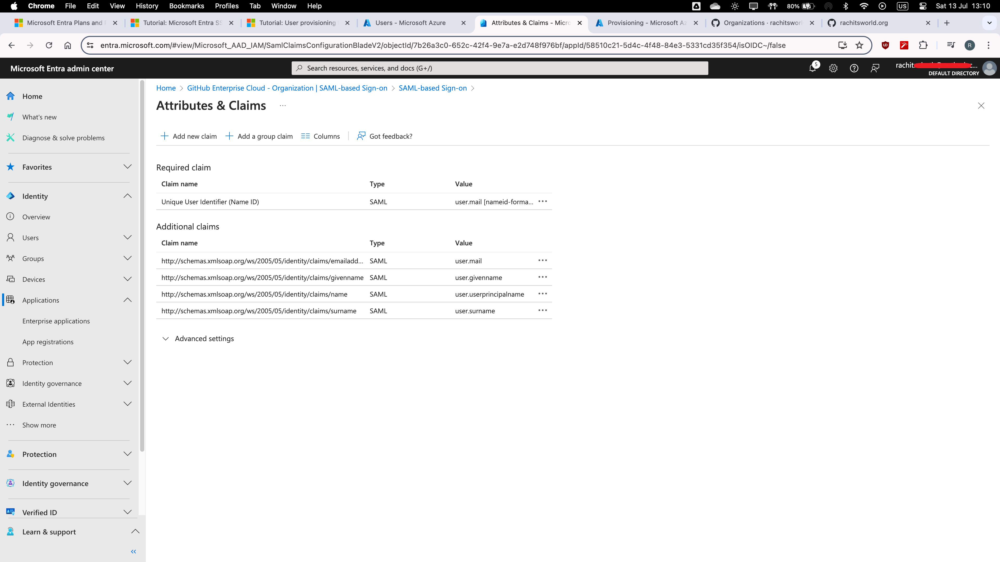
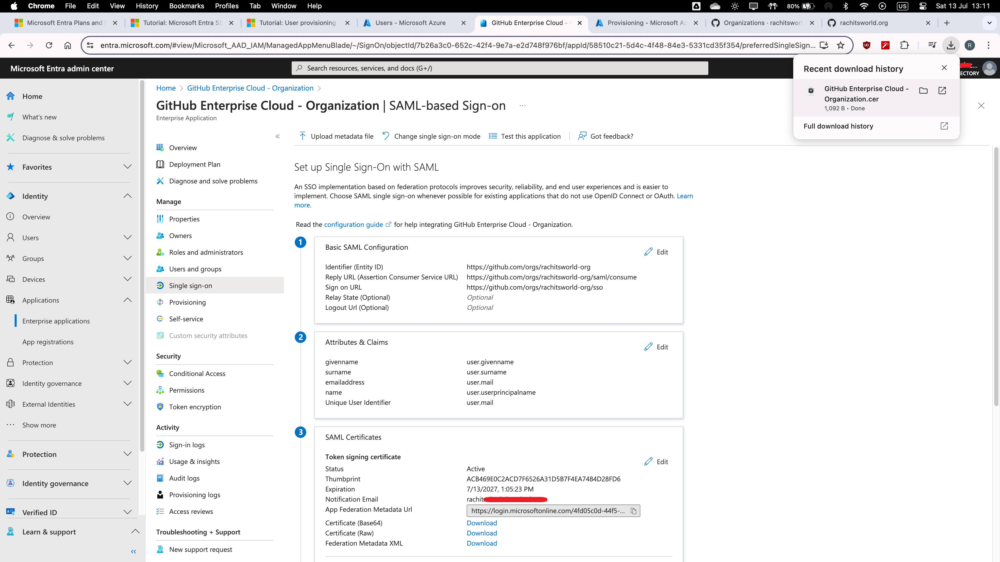
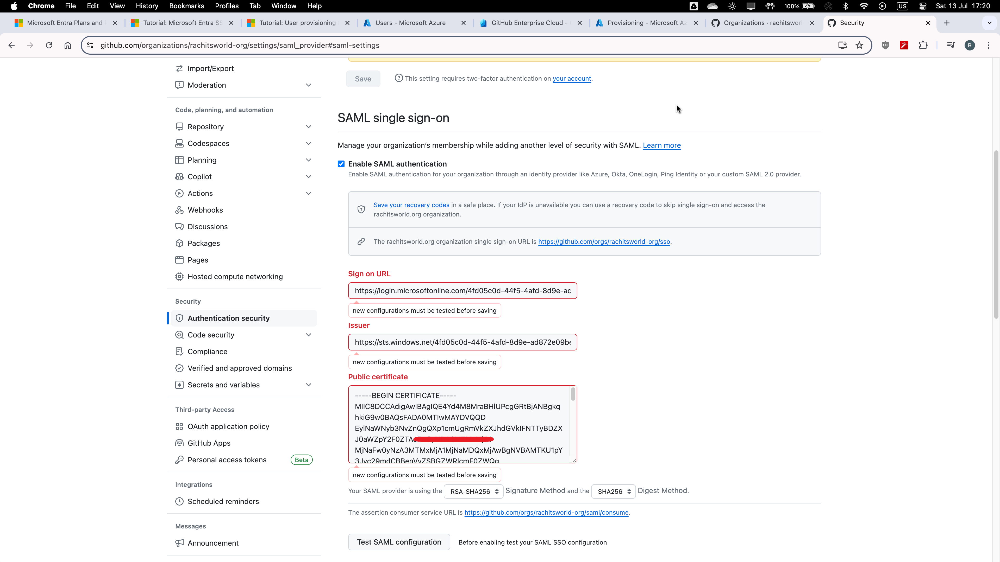

## GitHub Enterprise SSO Integration with Microsoft Entra ID using SAML 

## Introduction

Hi, I'm Rachit. This project focuses on setting up SSO for Microsoft Entra users to authenticate and access multiple applications. We will use GitHub Enterprise Cloud with SAML for authentication and authorization, and include automated provisioning capabilities.

In this guide, I will walk you through the process of integrating GitHub Enterprise Cloud with Microsoft Entra ID (formerly Azure Active Directory) to enable Single Sign-On (SSO) using SAML. This integration will streamline the authentication process for users, further automating user provisioning, providing a seamless and secure login experience.

## Table of Contents

1. [Prerequisites](#prerequisites)
2. [Step 1: Adding GitHub from the Gallery](#step-1-adding-github-from-the-gallery)
3. [Step 2: Configuring Microsoft Entra SSO](#step-2-configuring-microsoft-entra-sso)
4. [Step 3: Creating a Microsoft Entra Test User](#step-3-creating-a-microsoft-entra-test-user)
5. [Step 4: Assigning the Microsoft Entra Test User](#step-4-assigning-the-microsoft-entra-test-user)
6. [Step 5: Configuring GitHub SSO](#step-5-configuring-github-sso)
7. [Step 6: Creating a GitHub Test User](#step-6-creating-a-github-test-user)
8. [Step 7: Testing SSO](#step-7-testing-sso)
9. [Conclusion](#conclusion)
10. [Duty of Care and Due Diligence](#duty-of-care-and-due-diligence)
11. [Enhancement](#enhancement)

## Prerequisites

To get started, you need the following items:

- A Microsoft Entra subscription. If you don't have a subscription, you can get a free account [here](https://www.microsoft.com/en-gb/security/business/microsoft-entra-pricing). As of now, the free account allows authentication, single sign-on, and application access.
  - **Limitation**: The test user `Jane Doe` will not receive an email to validate the new GitHub signup. However, SSO test validation is possible at no cost, which is the primary objective of this project.
  
- A GitHub organization created in GitHub Enterprise Cloud, which requires the GitHub Enterprise billing plan. I have used the 30-day trial for this project [here](https://docs.github.com/en/get-started/start-your-journey/creating-an-account-on-github).
  - **Enterprise Name**: [rachitsworld-test](https://github.com/enterprises/rachitsworld-test/organizations)
  - **Organization Name/ID**: [rachitsworld-org](https://github.com/orgs/rachitsworld-org)
   
  


## Step 1: Adding GitHub from the Gallery

1. **Search GitHub Enterprise Cloud – Organization**: 
   - There are two options; select the one with user provisioning available to automate user provisioning as explained in [Enhancement](#1-automated-user-provisioning).
   

## Step 2: Configuring Microsoft Entra SSO

1. **Navigate to Entra Admin Center**:
   - Go to Applications > Enterprise Applications > GitHub Enterprise Cloud – Organization.
   
   - Select Single sign-on and choose SAML.
   
   
2. **Edit Basic SAML Configuration** with the following details:
   - **Identifier (Entity ID)**: `https://github.com/orgs/rachitsworld-org`
   
   Patterns:
   ```
   https://github.com/orgs/<ORGANIZATION_ID>
   ```
   - **Reply URL (Assertion Consumer Service URL)**: `https://github.com/orgs/rachitsworld-org/saml/consume
   `
   
   Patterns:
   ```
   https://github.com/orgs/<ORGANIZATION_ID>/saml/consume
   ```
   - **Sign on URL**: `https://github.com/orgs/rachitsworld-org/sso`
   
   Patterns:
   ```
   https://github.com/orgs/<ORGANIZATION_ID>/sso
   ```
   
   
3. **Under Attributes & Claims**:
   - Edit the Unique User Identifier value from `user.userprincipalname` to `user.mail`.
   
   

**Note:**
- GitHub application expects Unique User Identifier (Name ID) to be mapped with user.mail. Each application has distinct requirements, so attributes & claims must be tailored to meet the specific expectations of the application.

- Only two Attribute Mapping are necessary between GitHub and Microsoft Entra ID, as highlighted in the image below.

   Modifying one of these or enabling additional mappings may cause user identification or authentication and access problems or provisioning errors.
   
   The setting can be viewed / configured via [Entral Portal](https://entra.microsoft.com) --> Application --> Enterprise applications --> GitHub Enterprise Cloud - Organization --> Provisioning --> Provisioning --> Mapping --> Click Provision Microsoft Entra ID Users.


4. **Download the Certificate (Base64)** from SAML certificates.
   - Use a text editor to open the certificate on MacOS or Notepad on Windows. I used Microsoft Visual Studio Code.
   
   

5. **Under Set up GitHub Enterprise Cloud – Organization:**

Note down the following information for [Step 5](#step-5-configuring-github-sso)

   - **Login URL**: `https://login.microsoftonline.com/4fd05c0d-44f5-4afd-8d9e-ad872e09be58/saml2`
   - **Microsoft Entra Identifier**: `https://sts.windows.net/4fd05c0d-44f5-4afd-8d9e-ad872e09be58/`
   - **Logout URL**: `https://login.microsoftonline.com/4fd05c0d-44f5-4afd-8d9e-ad872e09be58/saml2`
   

**Note**: Do not test the Microsoft Entra SSO configuration yet as we still need to [Configure GitHub SSO](#step-5-configuring-github-sso). Testing now will result in an error.

## Step 3: Creating a Microsoft Entra Test User

1. **Create a New User**:
   - Go to Users > All Users > New User in Microsoft Entra Admin Center.
   - Enter basic details, review and create the user.
      - **Details**:
      - Username: `jane.doe@example.onmicrosoft.com`
      - Password: `*********`
   


2. **Assign Roles**:
   - Assign the Cloud Application Administrator role to the user. (This is mandatory)
   
   - Why assigning Cloud Administrator roles is mandatory?
      - Because the GitHub App registration allows Cloud Administrator's for granting access for privileged actions in Microsoft Entra ID.
   Visit [Entra Portal](https://entra.microsoft.com) to access `App registration` and follow steps as shown below:

      
       

**Note**: Downloading and editing the CSV template can speed up the creation of multiple users.

## Step 4: Assigning the Microsoft Entra Test User

1. **Assign the User to GitHub Enterprise Cloud – Organization Application**:
   - Go to Microsoft Entra Admin Center
   - Go to Applications > Enterprise Applications > GitHub Enterprise Cloud – Organization > Users and Groups.
   - Add User/Group and select Jane Doe.
   
   

**Note:** Adding the Microsoft Entra Administrator to the GitHub application is essential for configuring GitHub SSO. Otherwise, the testing in [Step 5](#step-5-configuring-github-sso) will result in an error as shown below:




## Step 5: Configuring GitHub SSO

1. **Sign into GitHub** as an administrator.
2. **Navigate to Settings** > Authentication Security.
3. **Enable SAML Authentication**:
   - Use the details from [Step 2.5](#step-2-configuring-microsoft-entra-sso), saved in the text editor to fill in the SSO configuration on GitHub.
   - Ensure the Signature Method and Digest Method are set to `RSA-SHA256` and `SHA256`, respectively.
   
   
   
   

## Step 6: Creating a GitHub Test User
The objective of this section is to create a user named Jane Doe in GitHub.
1. **Visit**: [myapplications.microsoft.com](https://myapplications.microsoft.com/)
2. **Login**:
   - Username: `jane.doe@rachitnshethoutlook.onmicrosoft.com`
   - Password: `*********`

3. **Click GitHub Enterprise Cloud – Organization**.
   
4. **Complete GitHub Signup** for Jane Doe using the enterprise email ID.
   
   
   
   

**Note:**
- Jane Doe will be prompted to change her Microsoft email password, and the GitHub account will be created once the GitHub verification is completed.
- When Jane Doe clicks the GitHub application from the [myapplications.microsoft.com](https://myapplications.microsoft.com/) homepage, it confirms that the SSO [links](images/step6.3_sso_redirect_for_new_user.png) are functioning correctly. The following step is not necessary, however, I have included additional methods to test SSO in the final step below as best practice for the Cloud Administrator.

## Step 7: Testing SSO

### Option 1

1. **Sign in to the Azure Portal**:
   - Go to [Azure Portal](https://portal.azure.com/) and sign in with an account that has the necessary permissions.
2. **Navigate to Azure Active Directory**:
   - Click on Azure Active Directory.
3. **Go to Enterprise Applications**:
   - Search for and select your "GitHub Enterprise Cloud - Organization" application.
4. **Test the Application**:
   - In the application settings, click on Single sign-on.
   - Click on Test this application.

   

### Option 2

1. **Go to GitHub Sign-on URL** directly and initiate the login flow. Refer [Step 2.2](#step-2-configuring-microsoft-entra-sso)

   


## Conclusion

This guide has demonstrated my in-depth knowledge and expertise in integrating GitHub Enterprise Cloud with Microsoft Entra ID for SAML-based Single Sign-On. By following these detailed steps, you can ensure a secure and seamless login experience for your users. This project showcases my ability to implement advanced authentication solutions, highlighting my technical proficiency.

## Duty of Care and Due Diligence

- Users invited or auto-provisioned should adhere to a complex password policy to enhance security. Additionally, enabling two-factor authentication (2FA) on GitHub accounts will further strengthen the security posture.

- When implementing SSO and integrating cloud services, it is crucial to follow security best practices, ensure compliance with organizational policies, and regularly monitor and update configurations to maintain security integrity. Always test configurations in a controlled environment before deploying to production.

- Ensure that only authorized personnel have access to configure and manage user provisioning settings. Regularly review and audit access policies and logs to maintain security and compliance within your organization.

---
## Enhancement:

## 1. Automated User Provisioning

### Prerequisites

1. **Automated User Provisioning (Organization Invitations)**: Requires adding GitHub from the Gallery.
2. **SAML Configuration**: Ensure SAML is configured for the GitHub Enterprise Cloud organization.
3. **Third-Party Application Access Policy**: Grant access for Microsoft Azure AD SCIM provisioning under Organization settings -> OAuth application policy.

### Steps to Enable Automated User Provisioning

1. **Navigate to Azure Portal**:
   - Go to the [Azure portal](https://portal.azure.com).
     - You can also navigate through the Microsoft Entra Admin Center, which will redirect you to the Azure Portal for these settings.
   - Search for "Enterprise Applications".

2. **Select GitHub Enterprise - Cloud Application**:
   - Select the GitHub Enterprise - Cloud application.
   - Go to the "Provisioning" section.

3. **Configure Provisioning**:
   - Select `Automatic` for the provisioning mode.
   - Enter the GitHub API link pointing to your organization. Use the following syntax:
     ```
     https://api.github.com/scim/v2/organizations/<Organization_name>
     ```
      

4. **Authorize Application**:
   - Click "Authorize".
   - Enter your GitHub Enterprise administrator credentials.
   - Authorize `azread-scim-dev`.
   

5. **Test and Save Settings**:
   - Test the settings to ensure they are correct.
   
   - Save the settings on Azure Portal.
   
   - Save the settings on Microsoft Entra Admin Center.
   

6. **Enable Provisioning**:
   - Return to the Entra Admin Center.
   - Under "Provisioning Status", select "On".
   - In the GitHub Enterprise Cloud - Organization | Provisioning settings, change the provisioning mode to "Sync all users and groups".
   

### Handling Authorization Errors

- **Processing Authorization Error**:
  - If you encounter an error, ensure that the third-party application access policy is granted under Organization settings -> OAuth application policy.
  
  - The screenshot below demonstrates granting Microsoft Azure AD SCIM provisioning.
  
  
  
  
- **User Identification / Authentication and Access / Provisioning Errors**:
   - Ensure 2 key attribute mappings between GitHub and Microsoft Entra ID are correctly configured.
   
      Refer to the **Notes** in the [`Step 2.3`](#step-2-configuring-microsoft-entra-sso) section for more details.
      [3] 
   
      

### Testing Provisioning

1. **Create a Test User and assign the role**:
   - Create a user named "Captain America" and assign the Cloud Application Administrator role.
   
   
   
   - Monitoring auto provisioning success
   
   

2. **Verify Logs (Azure Provisioning Logs)**:
   - Check the logs to confirm that auto-provisioning has occurred.
   

3. **Verify SCIM Invitations (GitHub Organization --> People)**:
   - Check the GitHub Organization's People tab to confirm SCIM invitations is sent out.
   

4. **Verify Audit Logs (GitHub Organizations --> Settings --> Logs --> Audit Logs)**:
   - Visit GitHub's Organizations to access Audit Logs, followed by Settings --> Logs. Search for "`jane`" or "`captain`", click on `...` (3 dots) to expand the event, and look for Key and value of `@timestamp` or `created_at` and match with Azure provisioning log. In this example, it is `2024-07-14 13:10:49 +0100`.
   
   

**Note:** The provisioning interval is fixed at 40 minutes. After the interval, verify that the user count has increased from 2 to 3.

### Revoking Authorization

1. **Log in to GitHub**:
   - Log in with your enterprise admin credentials.
   - From the dashboard, go to "Settings".

2. **Revoke OAuth App Authorization**:
   - Click "Applications" and select the "Authorized OAuth Apps" tab.
   - Select "Microsoft Azure AD SCIM provisioning" and revoke authorization.
   - Use the direct link: [GitHub Settings - Applications](https://github.com/settings/applications)
   

## Conclusion - Automated User Provisioning

Automating user provisioning streamlines and enhances the efficiency of managing user access within an organization. This guide demonstrates my ability to set up and manage automated user provisioning between Azure AD and GitHub Enterprise Cloud, or any other application, effectively. This project highlights my skills in optimizing access management processes

---